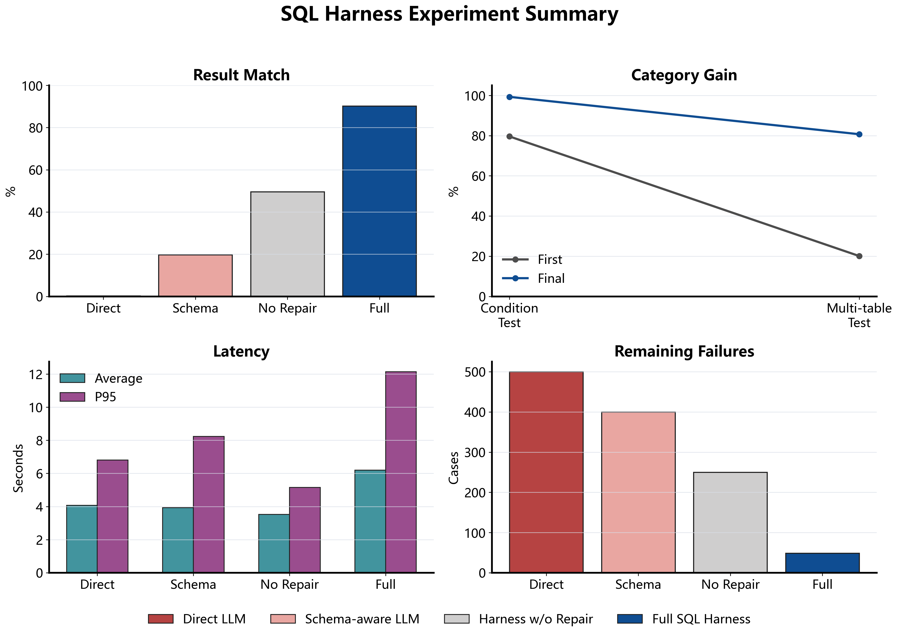
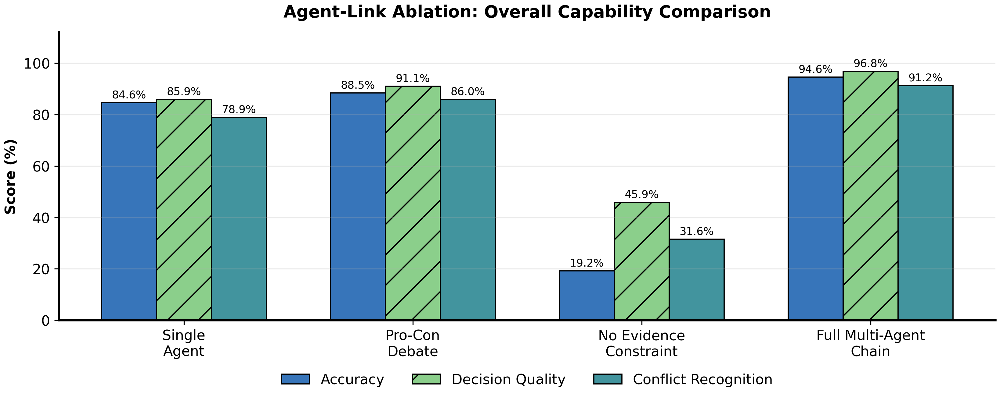

# BianLunTing

**An Evidence-grounded Multi-Agent Policy Review Framework for Chinese Local Governance Scenarios**

[中文说明](docs/README.zh-CN.md) | [Development Guide](docs/development.md) | [Roadmap](ROADMAP.md) | [Contributing](CONTRIBUTING.md)

<p align="center">
  
</p>

BianLunTing (辩论庭) is an open-source framework for traceable qualification review in Chinese local-governance scenarios. It turns regional policy clauses, structured evidence, and multi-agent deliberation into auditable review workflows.

The repository currently provides demo policy packs and simulated datasets for reproducible development and evaluation. It is a decision-support framework, not a replacement for authorized human review.

## Why Policy Review Is Hard

Local qualification review rarely reduces to a single rule lookup. A decision may depend on household registration, employment status, social-insurance records, local subsidy rules, region-specific exclusions, and missing evidence that must be reviewed manually.

This creates a reasoning problem with three requirements:

- decisions should be grounded in verifiable evidence;
- disagreements and missing evidence should remain visible;
- policies and data sources should be replaceable without rewriting the core engine.

## Why Chinese Local Governance Scenarios Matter

Chinese local policies exhibit strong regional characteristics. Similar public-service programs may use different eligibility clauses, evidence requirements, and exclusion rules across regions.

BianLunTing treats this complexity as a first-class engineering concern. Policy rules, evidence requirements, data-source mappings, and collection strategies are separated into declarative packs so that the review engine can evolve without hard-coding one policy or one database schema.

## How It Works


## Core Capabilities

- **Declarative Policy Packs**: structure policy rules, evidence requirements, prompts, and report templates as replaceable YAML packages.
- **Pluggable Data Source Packs**: map logical evidence fields to concrete schemas while keeping credentials outside the repository.
- **Rule-guided Text-to-SQL Retrieval**: collect database facts as evidence for policy clauses rather than treating SQL generation as an isolated task.
- **Execution-feedback SQL Repair**: diagnose and repair generated SQL through execution results and constrained post-processing.
- **Structured Evidence Cards**: convert query results into review-oriented evidence items with provenance, diagnostics, and confidence metadata.
- **Multi-Agent Deliberation**: expose strict-compliance, service-oriented, audit, empirical, and exploratory perspectives before arbitration.
- **Conflict-aware Decision Synthesis**: combine attack detection, proof standards, decision semantics, and a unified decision engine.
- **Human-in-the-loop Review**: preserve manual supplements, review actions, session history, and runtime trace events.

## Repository Map

| Path | Purpose |
| --- | --- |
| `policy_packs/` | Declarative policy definitions and evidence requirements |
| `data_source_packs/` | Replaceable data-source metadata and schema mappings |
| `collectors/` | Collector registry and structured payload ingestion |
| `text2sql/` | SQL generation, repair, execution, and evidence assembly |
| `evidence/` | Evidence-domain models and projection |
| `agents/` | Deliberation roles, orchestration, conflict detection, and arbitration |
| `runtime/` | Trace and memory primitives |
| `privacy/` | Sensitive-value sanitization |
| `api/` | FastAPI application |
| `frontend/` | Vue-based review interface |

## Included Demo Packs

The repository includes:

- policy packs for flexible-employment social-insurance subsidy review and enterprise social-insurance active service;
- a MySQL demo data-source pack;
- a structured `table_payload` data-source pack for integrating preprocessed Excel, API, or form data;
- unit tests and evaluation scripts for the SQL and multi-agent pipelines.

## Quick Start

### Requirements

- Python 3.11+
- Node.js 20+
- MySQL 8.0+ for the default SQL demo
- an LLM API key

### Install

```powershell
Copy-Item config\.env.example config\.env
python -m venv .venv
.\.venv\Scripts\Activate.ps1
python -m pip install -r requirements.txt
npm.cmd --prefix frontend install
```

Add local database and model configuration to `config/.env`. Never commit API keys, database passwords, or sensitive review data.

### Run

```powershell
.\scripts\start-all.ps1
```

The backend health endpoint is `http://localhost:8000/api/health`. Vite normally serves the frontend at `http://localhost:5173`.

### Validate Packs

```powershell
.\scripts\validate-packs.ps1
```

For test layers, environment details, API examples, and extension points, see the [development guide](docs/development.md).

## Evaluation

The repository contains reproducible experiments for Text-to-SQL generation and repair, evidence diagnostics, pack validation, multi-agent ablations, runtime trace, persistence, privacy, and MCP security behavior.

Evaluation results are based on simulated data and controlled test cases. They should not be interpreted as production validation for any public-service workflow.

### Text-to-SQL Harness

The SQL harness compares direct generation, schema-aware generation, execution without repair, and the full repair-enabled pipeline.



### Multi-Agent Ablation

The controlled ablation compares simplified agent links with the complete evidence-constrained deliberation pipeline.



## Current Boundaries

- The built-in datasets are simulated and desensitized demo materials.
- Real business-system API integration remains roadmap work.
- Region-specific policy packs require domain review before use.
- Final qualification decisions must remain subject to authorized human review.

## Open-source Roadmap

The next steps focus on reusable policy-pack authoring, additional collectors, replayable evaluation fixtures, documentation, and governance-oriented review safeguards. See [ROADMAP.md](ROADMAP.md).

## Contributing

Issues, policy-pack examples, collector integrations, tests, and documentation improvements are welcome. Please read [CONTRIBUTING.md](CONTRIBUTING.md) before submitting a pull request.

## License

Licensed under the [Apache License 2.0](LICENSE).
